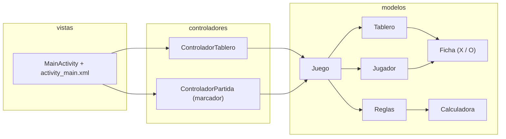

<div align="center">
  
  <h1>TicTacDuel</h1>
  <p><b>Tres en Raya para Android en Java: duelo de dos jugadores en el mismo móvil, con marcador de sesión.</b></p>
  
  
  
  
  <a href="https://github.com/Luiss2080/TicTacDuel/actions/workflows/ci.yml"></a>
  <p>
    <a href="#-inicio-rápido">Inicio rápido</a> ·
    <a href="#-características">Características</a> ·
    <a href="#️-arquitectura">Arquitectura</a> ·
    <a href="#-pruebas">Pruebas</a> ·
    <a href="#-lo-que-todavía-no-existe">Limitaciones</a>
  </p>
</div>

**TicTacDuel** es una app Android nativa (Java, Material 3) del clásico Tres en Raya para **dos personas que comparten el mismo dispositivo**: X empieza y O responde. Es un proyecto pequeño de aprendizaje/portafolio con la lógica separada de la interfaz y probada en la JVM. **No** tiene IA, modo en línea ni está publicada en ninguna tienda.

## 🎬 Vista rápida

No hay capturas: el proyecto no se pudo ejecutar en un emulador al preparar este README. Este es el flujo real de una partida:

```text
  JUGADOR X  0   VS   0  JUGADOR O          <- marcador de sesión
 ┌───┬───┬───┐
 │ X │ O │ X │   1. Toca una casilla vacía: aparece la ficha del turno actual
 ├───┼───┼───┤   2. El estado indica el turno de X o de O
 │   │ X │   │   3. Con 3 en línea o tablero lleno, el tablero se bloquea
 ├───┼───┼───┤      y el estado muestra ganador o empate
 │ O │   │ X │   4. [REINICIAR] nueva partida, conserva el marcador
 └───┴───┴───┘      [NUEVO JUEGO] nueva partida y marcador a cero
```

## ✨ Características

| Característica | Detalle |
|---|---|
| Duelo local | Dos jugadores por turnos en un tablero 3x3; X empieza siempre. |
| Victoria | Detecta las **8 líneas** (3 filas, 3 columnas, 2 diagonales). |
| Empate | Solo con tablero lleno **y** sin ganador: ganar en la novena casilla es victoria. |
| Jugadas válidas | El propio modelo rechaza casillas ocupadas, fuera de rango y jugadas tras terminar la partida. |
| Marcador de sesión | Victorias por jugador; **Reiniciar** lo conserva, **Nuevo juego** lo pone a cero. |
| Rotación de pantalla | Tablero, turno y marcador se guardan en `onSaveInstanceState` y se restauran. |
| Interfaz | Material Components (tema `Material3.DayNight`), colores distintos por jugador. Fondo degradado y varios colores del layout son fijos. |

## 🏗️ Arquitectura

MVC sencillo en el paquete `com.example.tresenrayaandroid`. El modelo no depende de Android.



`Reglas` valida movimientos y delega la detección de las 8 líneas en `Calculadora`. `Juego` también serializa/restaura el estado como una cadena de 9 caracteres `X`/`O`/`-`.

## 🚀 Inicio rápido

| Requisito | Versión |
|---|---|
| JDK | 17 (lo pide Android Gradle Plugin 8.x) |
| Android SDK | plataforma API 36 (`compileSdk`/`targetSdk` 36, `minSdk` 24) |
| Gradle / AGP | wrapper Gradle 8.13, AGP 8.13.2 (el wrapper descarga Gradle) |

1. Clona el repositorio y entra en la carpeta:
   ```bash
   git clone https://github.com/Luiss2080/TicTacDuel.git
   cd TicTacDuel
   ```
2. Compila el APK de depuración (queda en `app/build/outputs/apk/debug/`):
   ```bash
   ./gradlew assembleDebug
   ```
3. Instálalo en un emulador o dispositivo conectado:
   ```bash
   ./gradlew installDebug
   ```

También puedes abrir la carpeta en Android Studio y pulsar **Run**. Si hace falta, crea `local.properties` con `sdk.dir=<ruta-a-tu-SDK>` (está ignorado por git).

> Verificación: los comandos de compilación no se ejecutaron al preparar este README (no había Android SDK ni JDK 17 en la máquina); los pasos se apoyan en la configuración del proyecto y en la CI.

<details>
<summary>📁 Estructura de carpetas</summary>

```text
app/src/main/java/com/example/tresenrayaandroid/
  modelos/        Ficha, Jugador, Tablero, Calculadora, Reglas, Juego
  controladores/  ControladorTablero, ControladorPartida
  vistas/         MainActivity
app/src/main/res/layout/activity_main.xml
app/src/test/     6 clases de test JUnit 4 (JVM)
app/src/androidTest/  solo el ExampleInstrumentedTest de la plantilla
.github/workflows/ci.yml
```

</details>

## 🧪 Pruebas

```bash
./gradlew test
```

Hay **31 tests JUnit 4** (conteo de métodos `@Test` en el código; no pude ejecutarlos localmente, la CI los ejecuta en cada push y pull request con JDK 17): `CalculadoraTest` (5), `TableroTest` (5), `JuegoTest` (7), `JuegoEstadoTest` (7), `JuegoRobustezTest` (3) y `ControladorTest` (4). Cubren las 8 líneas para X y O, falsos positivos, empate, victoria en la novena casilla, casillas ocupadas o fuera de rango, jugadas tras terminar, reinicio, marcador y serialización/restauración.

`MainActivity` no tiene tests automatizados; solo existe el `ExampleInstrumentedTest` de la plantilla.

## 🚧 Lo que todavía no existe

- IA, modo de un jugador o multijugador en línea.
- El marcador vive en memoria: se pierde al cerrar la app (solo sobrevive a la recreación de la actividad).
- Varios textos (título, subtítulo, botones) están escritos directamente en el layout y no en `strings.xml`; solo hay español.
- Sin animaciones, sonidos ni accesibilidad más allá de la de Material Components.
- Sin tests de interfaz reales.
- `applicationId` de plantilla (`com.example.tresenrayaandroid`); el build *release* no está firmado ni minificado.

## 📄 Licencia

Sin licencia definida: todos los derechos reservados por defecto. Para permitir su reutilización habría que añadir un archivo `LICENSE`.

<div align="center"><sub>Hecho por Luiss2080 · Tres en Raya en Java, con lógica probada en la JVM</sub></div>
